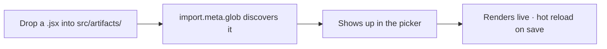

# Artifact Viewer

[](https://github.com/jochien/artifact-viewer/actions/workflows/ci.yml)

A tiny local viewer that renders React/JSX artifacts the moment your AI writes them.
Think of it as Claude's Artifacts panel, pulled out of the browser and parked next to
your VS Code editor.

## The problem

Your AI hands you a slick React component and you're stuck:

- *"Now where do I actually run this?"*
- *"Guess I'll spin up a throwaway Vite app. Again."*
- *"Pasting into an online sandbox for the tenth time today."*

## The idea

Claude's web UI renders a generated component in a side panel while you keep talking.
VS Code has no such thing. So this is that panel, self-hosted and exactly one folder deep.



- **Drop a file.** Any `.jsx` that `export default`s a component goes in `src/artifacts/`.
- **It just appears.** A single `import.meta.glob` finds it, adds it to the dropdown, and
  hot-reloads every time you save.
- **Errors stay contained.** A broken artifact prints its stack trace inline instead of
  taking down the whole viewer.

## What you get back

**See it, tweak it, keep it.** Every artifact your agent generates becomes something you
can look at instantly, iterate on in your real editor, and keep in one place.

## Where this is going

This is v0.1, and it's deliberately manual: start the server, run a command, drop a file.
The goal is to make it disappear. Picture right-clicking a `.jsx` and having it render on
the spot, in a VS Code panel or a popped-out browser window, with none of the setup in
between. This release is the engine; the seamless trigger comes next.

---

## Run it

Works anywhere Node runs (macOS, Windows, Linux). You'll need **Node 18+** and npm.

```bash
npm install          # first time only
npm run dev          # starts http://localhost:5188
```

Open the URL in a browser, or stay in the editor:
Command Palette → **Simple Browser: Show** → `http://localhost:5188`.

## Add an artifact

Copy a `.jsx` file into `src/artifacts/`, or:

```bash
npm run add -- /path/to/your-artifact.jsx
```

Either way it appears in the picker at the top of the viewer automatically (hot reload).
The repo ships with a gallery of examples (see below), so there's plenty to look at on
first run.

## Example artifacts

Seven artifacts ship in `src/artifacts/`, each a single self-contained file that imports
only `react` and `lucide-react`, so they render with zero install. They double as a tour
of what fast React prototyping is good for:

- **Memory match** (`memory-match-game.jsx`) — a playable concentration game.
- **Pomodoro timer** (`pomodoro-timer.jsx`) — focus/break cycles with an SVG progress ring.
- **Generative art studio** (`generative-art-studio.jsx`) — seeded, reproducible SVG art with SVG export.
- **Trivia quiz** (`trivia-quiz.jsx`) — a scored multiple-choice quiz with a results screen.
- **SaaS pricing page** (`saas-pricing-page.jsx`) — a marketing page with a monthly/annual toggle.
- **Invoice builder** (`invoice-builder.jsx`) — an editable invoice with live totals and print.
- **Protection plan comparator** (`protection-plan-comparator.jsx`) — the original ledger-style demo.

## How it works

The whole thing is one screen ([src/App.jsx](src/App.jsx)):

- `import.meta.glob("./artifacts/*.jsx")` lazily discovers every artifact at build time.
- The picker sets the selected module; `React.lazy` loads it on demand.
- An `ErrorBoundary` catches runtime errors and renders the stack inline.

That's the entire architecture. No database, no config, no accounts.

## Notes

- Artifacts must `export default` a React component (Claude/Cursor/Copilot artifacts do).
- `react`, `react-dom`, and `lucide-react` are installed. If an artifact imports something
  else (`framer-motion`, `recharts`, and so on), install it: `npm install <package>`.

## Roadmap & contributing

Planned features (right-click-to-view, one-command launch, `.tsx` support, and more) are
tracked in [GitHub issues](https://github.com/jochien/artifact-viewer/issues). Pull
requests run a CI build on Node 18 and 20; `main` is protected and requires that check to
pass before merge.

## License

[MIT](LICENSE).
